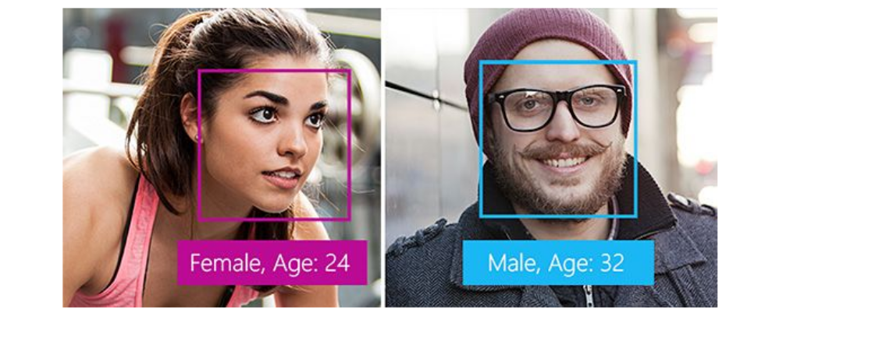
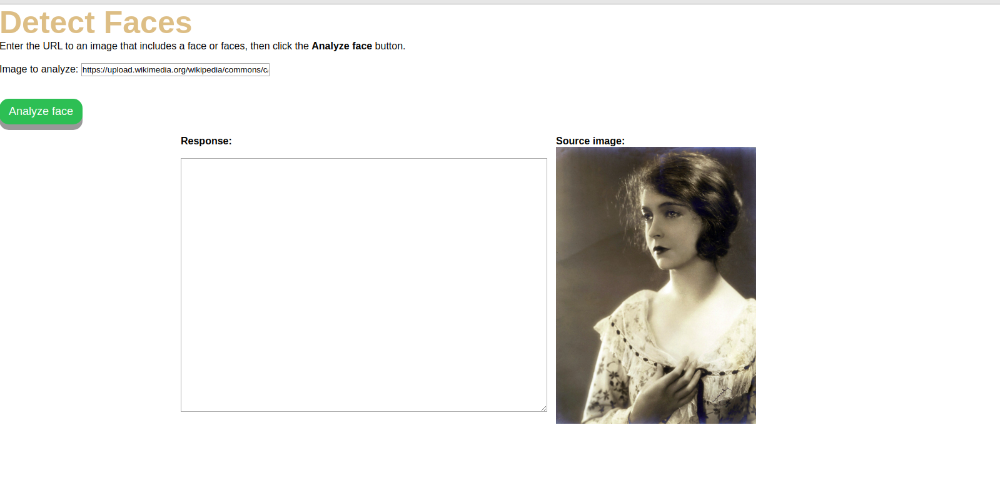

# Detect faces in an image using the REST API and JavaScript

In this tutorial, you will use the Azure Face REST API with JavaScript to detect 
human faces in an image

## Face detection

The Face API can detect human faces in an image and return the rectangle coordinates of their locations. Optionally, face detection can extract a series of face-related attributes such as pose, gender, age, head pose, facial hair, and glasses.

<p></p>

The face detection feature is also available through the [Computer Vision API](https://docs.microsoft.com/azure/cognitive-services/computer-vision/home), but if you wish to do further operations with face data, you should use the Face API (this service). For more information on face detection, see the [Detect API](https://westus.dev.cognitive.microsoft.com/docs/services/563879b61984550e40cbbe8d/operations/563879b61984550f30395236)

## Prerequisites

* A Face API subscription key. You can get a free trial subscription key from [Try Cognitive Services](https://azure.microsoft.com/try/cognitive-services/?api=face-api). Or, follow the instructions in Create a [Cognitive Services account](https://docs.microsoft.com/azure/cognitive-services/cognitive-services-apis-create-account) to subscribe to the Face API service and get your key :)

* A code editor such as [Visual Studio Code](https://code.visualstudio.com/download)

## Initialize the HTML file

```html
    <!DOCTYPE html>
    <html>
        <head>
            <title>Detect Faces Sample</title>
            <script src="http://ajax.googleapis.com/ajax/libs/jquery/1.9.0/jquery.min.js"></script>
        </head>
    <body></body>
</html>
```
Then add the following code inside the body element of the document. This sets up a basic user interface with a URL field, an Analyze face button, a response pane, and an image display pane


## Run the script

Open index.html in your browser. When you click the Analyze face button, the app should display the image from the given URL and print out a JSON string of face data.

<p></p>

## Resume

In this tutorial, you wrote a JavaScript script that calls the Azure Face API to detect faces in an image and return their attributes. Next, explore the Face API reference documentation to learn more.
[Face Api](https://westus.dev.cognitive.microsoft.com/docs/services/563879b61984550e40cbbe8d/operations/563879b61984550f30395236)